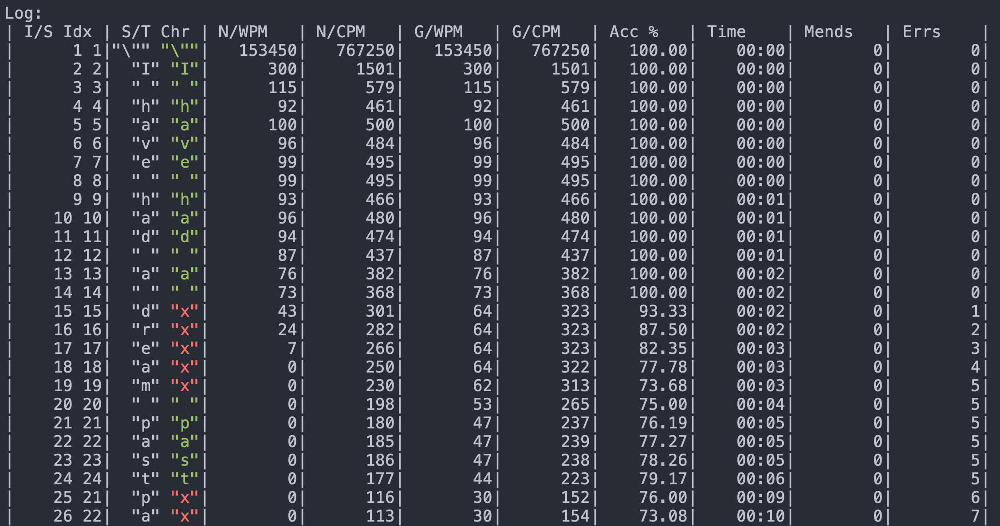

# Emacs Monkeytype

A typing game/tutor inspired by the open source and community driven [monkeytype.com](https://monkeytype.com) but for Emacs.

<!-- markdown-toc start - Don't edit this section. Run M-x markdown-toc-refresh-toc -->
**Table of Contents**

- [Emacs Monkeytype](#emacs-monkeytype)
    - [Usage](#usage)
    - [Features](#features)
        - [To come... (PRs welcome)](#to-come-prs-welcome)
        - [Tips](#tips)
    - [Commands / Key bindings](#commands--key-bindings)
    - [Customisation](#customisation)
    - [Log](#log)
    - [Install](#install)
    - [Changelog](#changelog)
        - [0.1.2](#012)
        - [0.1.1](#011)
        - [0.1.0](#010)
    - [License](#license)

<!-- markdown-toc end -->

## Usage

Use one of the functions to enter `monkeytype` mode (`monkeytype-region`, `monkeytype-buffer`, etc... see [Commands](#commands--key-bindings) section below).

(Note: You should bind these functions to anything you want in your `.emacs`.)

The buffer should look as follows:


The section inside the red rectangle is Monkeytype's mode-line and the following is the fields breakdown:

**MT[WPM/GWP Accuracy Elapsed-time (words/corrections/errors)]**

Then you can either type all the way to the end or stop/finish (`C-c C-C s` / `monkeytype-stop`).

The buffer should look as follows:


This Results buffer re-renders the typed text highlighting errors and either correct or incorrect corrections
(highlighted with a different background and slightly different colour).

At this point you can either practice mistyped words with `monkeytype-mistyped-words`  or just troubling/hard transitions with `monkeytype-hard-transitions` (`C-c C-c h`).

## Features

- Type any text you want.
- Practice mistyped words.
- UI customisation.
- Mode-line live WPM (`monkeytype-mode-line-interval-update` adjust the update frequency).
- Visual representation of typed text including errors and retries/corrections.
- Auto stop after 5 seconds of no input (`C-c C-c r` [ `monkeytype-resume` ] resumes).
- Optionally randomise practice words/transitions (see: `monkeytype-randomize`).
- Optionally downcase practice words/transitions (see: `monkeytype-downcase`).
- Optionally treat newlines as whitespace (see: `monkeytype-treat-newline-as-space`).
- Optionally auto-fill text to the defaults `fill-column` value (see: `monkeytype-auto-fill`).
- Select a region of text and treat it as words for practice (e.i., optionally downcased, randomised, etc... see: `monkeytype-region-as-words`).
- After a test, practice troubling/hard key combinations/transitions (useful when practising with different keyboard layouts).
- Mistyped words or hard transitions can be saved to `~/.monkeytype/{words or transitions}` (see: `monkeytype-directory` `monkeytype-save-mistyped-words` `monkeytype-save-hard-transitions`).
- Saved mistyped/transitions files (or any file but defaults to `~/.monkeytype/` dir) can be loaded with `monkeytyped-load-words-from-file`.
- `monkeytype-word-regexp` customises the regexp used for removing characters from words (defaults to: ;:.\`",()-?!).

### To come... (PRs welcome)

- Save results / history

### Tips

- When using `evil-mode` it's useful to automatically enable `evil-insert` (to start typing right away).
- When using `evil-escape`, `evil-escape-mode` has to be disabled in order to prevent double keystrokes getting registered.
- Installing [`centered-cursor-mode`](https://github.com/emacsmirror/centered-cursor-mode) is useful for auto scrolling/paging in multi-page / long texts.

This can then be enabled in your `.emacs` with:

``` emacs-lisp
(add-hook 'monkeytype-mode-hook
  (lambda ()
    (centered-cursor-mode)
    (evil-escape-mode -1)
    (evil-insert -1)))
```

## Commands / Key bindings

| Key binding | Function                         |
| ----------- | --------                         |
| C-c C-c f   | monkeytype-fortune               |
| C-c C-c p   | monkeytype-pause                 |
| C-c C-c r   | monkeytype-resume                |
| C-c C-c s   | monkeytype-stop                  |
| C-c C-c t   | monkeytype-repeat                |
| C-c C-c m   | monkeytype-mistyped-words        |
| C-c C-c h   | monkeytype-hard-transitions      |
| C-c C-c a   | monkeytype-save-mistyped-words   |
| C-c C-c o   | monkeytype-save-hard-transitions |
|             | monkeytype-region                |
|             | monkeytype-buffer                |
|             | monkeytype-region-as-words       |
|             | monkeytype-load-words-from-file  |

## Customisation

Run `M-x customize-group RET` `monkeytype RET` or `monkeytype-faces RET`.

Or set the variables in your `.emacs` file:

``` emacs-lisp
(setq monkeytype-face-default '(:family "Menlo" :height 1.6 :foreground "#969896"))
(setq monkeytype-face-correct '(:foreground "#98be65"))
(setq monkeytype-face-error '(:foreground "#ff6c6b"))
(setq monkeytype-face-correction-error '(:inherit region :foreground "#ff6c6b"))
(setq monkeytype-face-correction-correct '(:inherit region :foreground "#98be65"))
(setq monkeytype-face-header-1 '(:foreground "#B7950B"))
(setq monkeytype-face-header-2 '(:foreground "#F1C40F"))
(setq monkeytype-face-header-3 '(:foreground "#F1C40F"))
(setq monkeytype-mode-line-interval-update 10)
(setq monkeytype-treat-newline-as-space t)
(setq monkeytype-minimum-transitions 50)
(setq monkeytype-insert-log nil)
(setq monkeytype-directory "~/.monkeytype")
(setq monkeytype-randomize t)
(setq monkeytype-dowcase t)
(setq monkeytype-word-regexp (concat
                              ":\\|"
                              ";\\|"
                              ",\\|"
                              "(\\|"
                              ")\\|"
                              "?\\|"
                              "!\\|"
                              " \\|"
                              "\"\\|"
                              "\n\\|"
                              "\`\\|"
                              "\\."))
```

## Log

Logging can be enabled for debugging purposes (see `monkeytype-insert-log` customisation).

When enabled it should look as follows:



## Install

Just drop `monkeytype.el` somewhere in your `load-path` and add it to your `.emacs`:

``` emacs-lisp
(add-to-list 'load-path "~/emacs.d/vendor")
(require 'monkeytype)
```

## Changelog

### 0.1.2

**Additions**

- `monkeytype-load-words-from-file`
- `monkeytype-region-as-words`
- Toggable option `monkeytype-downcase`
- Toggable option `monkeytype-randomize`
- `monkeytype-word-regexp`

**Changes**

- Rename option `monkeytype-downcase-mistype` to `monkeytype-downcase`
- Removed `async` lib

**Internal**

- Input processing logic rewrite
- Several renames and code reorganisation

**Fixes**

- Skipped text getting counters out of sync
- `evil-escape` double registering characters

### 0.1.1

**Additions**

- Allow to practice mistyped words.
- Allow to practice hard to type transitions.
- Allow to save mistyped words or transitions to `~/.monkeytype` directory.
- Option to auto-fill typing region.

**Changes**

- Change `monkeytype--mode-line-update-seconds` option to `monkeytype-mode-line>interval-update` to have it work with typed entries (keystrokes) defaulting to 1 (update on each keystroke).

**Internal**

- Removed `ht` library requirement.
- Updated Emacs requirement to 25.1.
- Misc layout improvements.

**Fixes**

- Have `local-idle-timer` stop on paused or finished status.

### 0.1.0

Initial release.

## License

GPLv3
